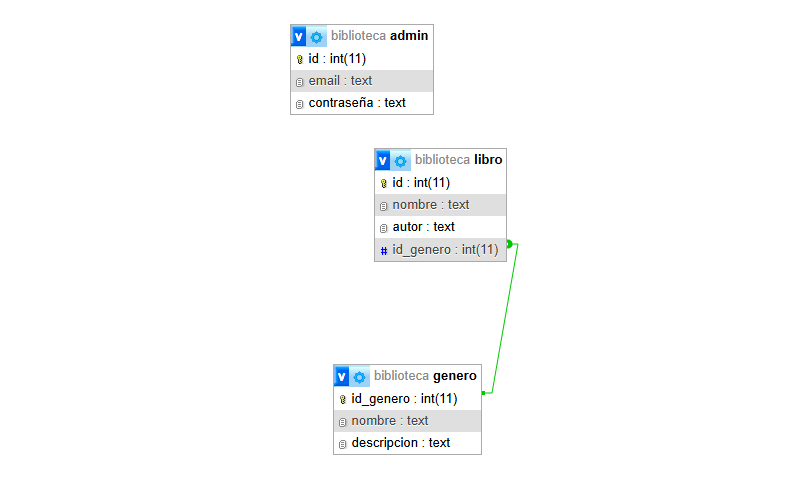

# Integrantes:
- Lucero Gasparini Rodriguez (lucerogasparini@gmail.com)
- Marco Ezequiel Fernandez (marcoeze14@gmail.com)

# Descripcion
El objetivo es crear un sistema de biblioteca donde hay multiples generos de libros pero cada libro puede tener un solo genero

# DER
